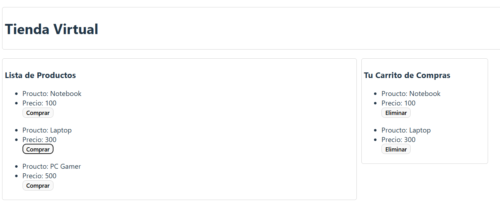

# Tienda de Productos Básica

 


## Descripción del Proyecto



Este proyecto es una implementación inicial de un concepto básico de **e-commerce** diseñado para practicar y consolidar los **fundamentos esenciales de React**.

Se centra en la gestión básica de un inventario y un carrito de compras. El objetivo principal fue realizar los **primeros pasos** en el desarrollo con React, enfocándose en la manipulación de estados y la renderización de componentes a través de una interfaz **minimalista** y funcional.

-----

## Características Principales

El proyecto ofrece las siguientes funcionalidades clave para simular una experiencia de compra básica:

  * **Listado de Productos:** Muestra una lista de productos pre-cargados disponibles para la venta.
  * **Añadir al Carrito:** Permite a los usuarios seleccionar un producto de la lista y agregarlo al carrito de compras.
  * **Eliminar del Carrito:** Proporciona la funcionalidad para remover un producto que ya ha sido agregado al carrito.
  * **Interfaz Minimalista:** Presenta un diseño simple y limpio, priorizando la funcionalidad sobre la complejidad visual.

-----

## Tecnologías Utilizadas

Las siguientes tecnologías y herramientas fueron fundamentales para el desarrollo de este proyecto:

  * **React:** La biblioteca principal de JavaScript para construir la interfaz de usuario.
  * **JavaScript (ES6+):** Utilizado para la lógica del componente y la gestión del estado.
  * **HTML5 & CSS3:** Empleados para la estructura y el estilo minimalista de la aplicación.
  * **NPM / Yarn:** Gestor de paquetes utilizado para manejar las dependencias del proyecto.

-----

## Instalación y Configuración

Para obtener una copia local en funcionamiento, sigue estos sencillos pasos.

### Prerrequisitos

Asegúrate de tener **Node.js** y **npm** (o **Yarn**) instalados en tu sistema.

### Pasos de Instalación

1.  **Clonar el Repositorio:**

    ```bash
    git clone https://github.com/kevincisnero01/basic_course_react.git
    ```
2.  **Navega al directorio del proyecto:**

    ```bash
    cd basic_course_react
    ```
3.  **Instalar Dependencias:**

    ```bash
    npm install
    ```

4.  **Ejecutar la Aplicación:**
    Inicia la aplicación en modo desarrollo.

    ```bash
    npm start
    ```
4.  **Abre tu navegador y visita:**
    ```bash
    http://localhost:5173
    ```

-----

## Estructura del Proyecto

A continuación, se detalla la estructura principal de carpetas y archivos del repositorio:

```
basic_course_react/
├── node_modules/
├── public/
│   ├── index.html
│   ├── favicon.ico
│   └── manifest.json
├── src/
│   ├── components/
│   │   ├── Cart.js
│   │   ├── Header.js
│   │   ├── ProductItem.js
│   │   └── ProductList.js
│   ├── data/
│   │   └── products.js
│   ├── App.css
│   ├── App.js
│   ├── index.css
│   └── index.js
├── .gitignore
├── package.json
├── package-lock.json
└── README.md
```